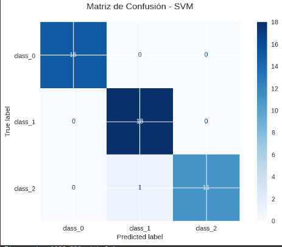
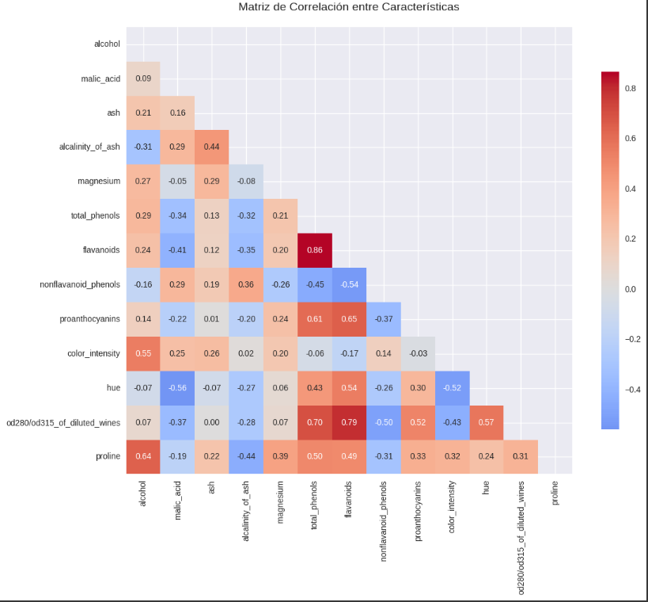

# 🍷 Proyecto Wine — Clasificación (Mod11 · Act2)

[](https://www.python.org/)
[](https://jupyter.org/)
[](LICENSE)

Este proyecto entrena y evalúa modelos de **clasificación multiclase** sobre el dataset *Wine* de Scikit-learn, utilizando Logistic Regression, Random Forest y SVM.  
Incluye búsqueda de hiperparámetros, validación cruzada y persistencia de artefactos.

---

## 🚀 Características principales

| Componente                | Descripción                                                                 |
|---------------------------|-----------------------------------------------------------------------------|
| Dataset                   | Wine (Scikit-learn)                                                         |
| Modelos                   | Logistic Regression, Random Forest, SVM                                     |
| Optimización              | RandomizedSearchCV con StratifiedKFold                                      |
| Métricas                  | Accuracy, Matriz de Confusión, Curvas ROC por clase                         |
| Persistencia              | Modelos `.joblib` y parámetros `.json` en carpeta `model/`                  |
| Entorno                   | Python 3.10+, dependencias en `requirements.txt`                            |

---

## 📂 Estructura del repositorio
```
proyecto-wine/
├─ notebooks/
│  └─ proyecto_wine_act2_mod11_v2.ipynb
├─ assets/
├─ src/                       
├─ model/                     
├─ data/                      
├─ README.md
├─ requirements.txt
├─ .gitignore
└─ LICENSE
```

> **Nota**: El notebook generado aquí ya incluye los parches clave: `penalty='none'` en LogisticRegression, `error_score=np.nan` en `RandomizedSearchCV`, y la importación de `display`.

## ▶️ Ejecutar en Google Colab

Puedes abrir y ejecutar este proyecto directamente en Google Colab haciendo clic en el botón:

[](https://colab.research.google.com/github/eagomezdaza/proyecto-wine/blob/main/notebooks/proyecto_wine_act2_mod11_v3.ipynb)


## 📊 Resultados

Matriz de confusión:



Matriz de correlación:




## Requisitos y entorno

- Python 3.10+ recomendado
- Paquetes listados en `requirements.txt`

### Opción A · Ejecutar en Google Colab
1. Sube el notebook `notebooks/proyecto_wine_act2_mod11_v2.ipynb` a tu repo de GitHub.
2. En Colab: **Archivo → Abrir cuaderno → GitHub** y pega la URL del notebook.
3. Ejecuta todas las celdas. (Colab instala dependencias por defecto; si necesitas versiones exactas, crea una celda:)
   ```python
   %pip install -r requirements.txt
   ```

### Opción B · Ejecutar en local (virtualenv)
```bash
# 1) Clonar el repo
git clone <URL_DE_TU_REPO>.git
cd proyecto-wine

# 2) Crear entorno
python -m venv .venv
source .venv/bin/activate   # Windows: .venv\Scripts\activate

# 3) Instalar dependencias
pip install --upgrade pip
pip install -r requirements.txt

# 4) Ejecutar notebook
jupyter notebook notebooks/proyecto_wine_act2_mod11_v2.ipynb
```
> Alternativa: `jupyter lab` o VS Code con la extensión de Jupyter.

## Uso del notebook
- Carga el dataset Wine desde `sklearn.datasets`.
- Separa *train/test* con estratificación.
- Define **pipelines** por modelo y sus **espacios de búsqueda**.
- Corre `RandomizedSearchCV` con validación cruzada (`StratifiedKFold`).
- Reporta métricas de test y guarda artefactos en `model/`:
  - `best_model_<nombre>.joblib`
  - `best_params_<nombre>.json`

## Resultados y métricas
- **Accuracy** en test.
- **Matriz de confusión**.
- **Curvas ROC** por clase (one‑vs‑rest).
- (Sugerido) añade `balanced_accuracy` y `f1_macro` si quieres robustez ante desbalance.

## Buenas prácticas
- Evita subir datos pesados al repo; usa enlaces o Git LFS si corresponde.
- Limpia salidas del notebook antes de commitear (reduce tamaño del `.ipynb`).
- Fija semillas (`random_state=42`) para reproducibilidad.

## Licencia
Este proyecto está licenciado bajo la licencia MIT.  
Consulta el archivo [LICENSE](LICENSE) para más detalles.
